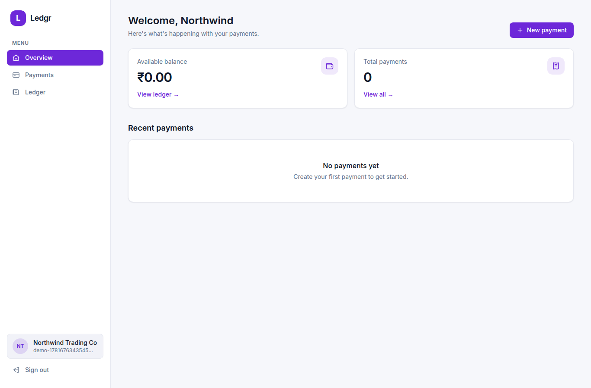
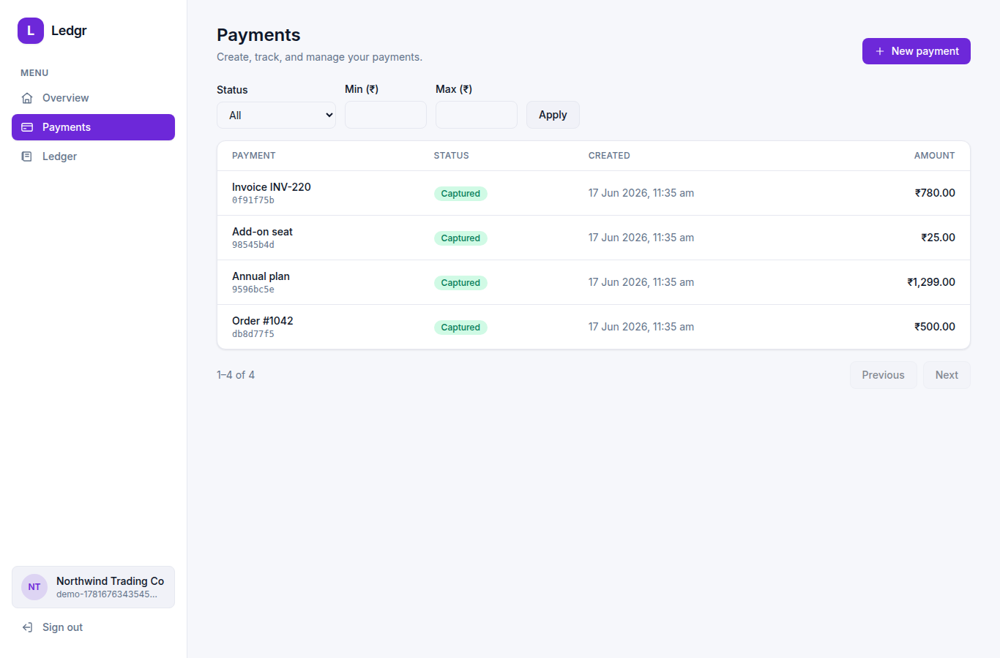
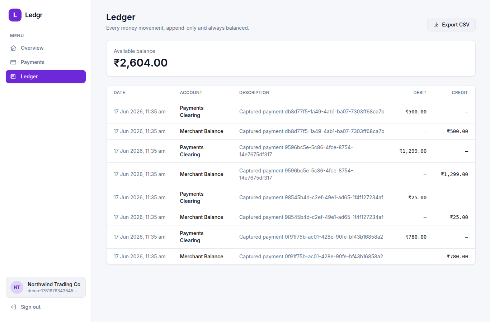
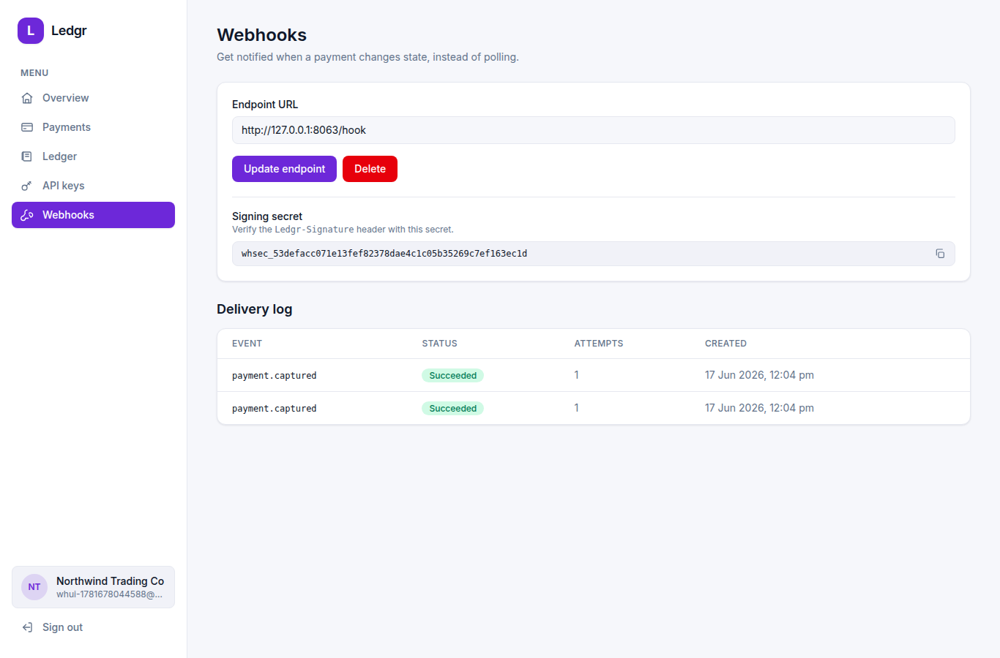
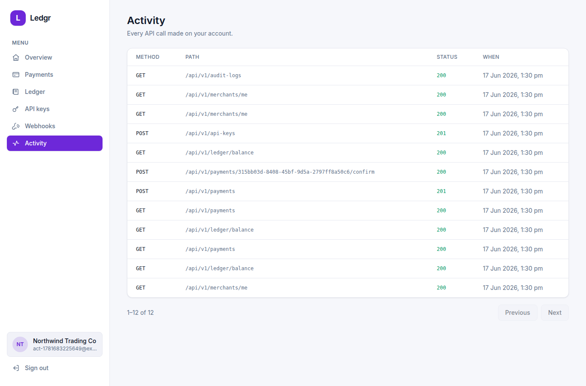
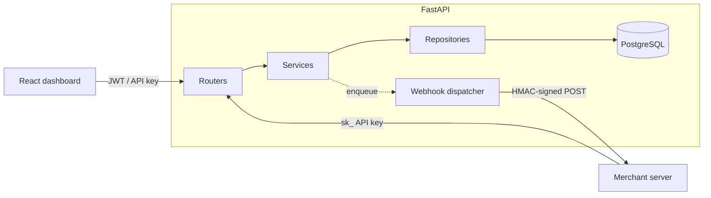

# Ledgr

[](https://github.com/Inbask2003/Ledgr/actions/workflows/ci.yml)
[](LICENSE)


A developer-facing **payments API** with a merchant dashboard — the kind of
service that sits behind a "Pay" button. Ledgr handles the parts that are easy
to get subtly wrong: tracking payment state, **never double-charging on
retries**, signing and retrying **webhooks**, and keeping a **double-entry ledger
that always balances**.

V1 is a sandbox — it mirrors real production patterns but runs against a mock
card processor instead of moving real money (INR only).



---

## Why this project is interesting

It's small enough to read in an afternoon but exercises the hard parts of a real
payments backend:

- **Idempotency under concurrency.** A unique `(merchant_id, idempotency_key)`
  guards against duplicates; the race is handled (catch the constraint
  violation, return the winner's record) and **tested with 8 concurrent
  identical requests producing exactly one payment**.
- **Double-entry ledger as the source of truth.** Every money movement writes a
  balanced set of debit/credit lines through a single helper that *refuses* to
  write an unbalanced batch — so the books can't silently drift.
- **Webhooks done properly.** HMAC-SHA256 signatures, an out-of-band dispatcher,
  retries with exponential backoff, a delivery log, and manual replay.
- **Operational maturity.** Audit log of every API call, a reconciliation job
  that proves the ledger balances, payment expiry, a DB-backed health check, and
  rate limiting.

## Features

| | |
|---|---|
| **Auth** | JWT for the dashboard + hashed `sk_` API keys for server-to-server |
| **Payments** | create → confirm → capture lifecycle, idempotent, forward-only states |
| **Refunds** | full and partial, can't exceed the original |
| **Ledger** | append-only double-entry, balance, CSV export |
| **Webhooks** | HMAC-signed events, backoff retries, delivery log, replay |
| **Audit log** | every API call recorded and browsable |
| **Ops** | reconciliation + expiry jobs, DB health check, rate limiting |

## Screenshots

| Payments | Ledger |
|---|---|
|  |  |

| Webhooks | Activity (audit log) |
|---|---|
|  |  |

## Architecture



The backend is layered — **routers stay thin, services hold the business rules
and own the transaction boundary, repositories do data access, and the domain
never imports FastAPI.** Background loops (webhook dispatch, reconciliation,
expiry) run inside the app and are also runnable as standalone jobs.

```
backend/app/
  api/v1/      routers: auth, merchant, payment, ledger, api_key, webhook, audit
  service/     business logic + webhook dispatcher + mock processor
  repository/  data access (flush only; services commit)
  model/       SQLAlchemy models + enums
  schema/      Pydantic request/response models
  core/        config, logging, security, tokens, deps, exceptions, rate limit
  jobs/        reconcile + expire (runnable and periodic)
frontend/src/  React 19 + Tailwind dashboard (lib, context, components, pages)
```

Each folder has a `CLAUDE.md` documenting its conventions.

## Quickstart

### With Docker (one command)

```bash
docker compose up --build
```

- Dashboard → http://localhost:5173
- API docs → http://localhost:8000/docs

(If port 8000 or 5173 is already in use, change the published port in
`docker-compose.yaml`.)

### Manual

```bash
docker compose up -d postgres          # just the database

cd backend
python -m venv venv && source venv/bin/activate
pip install -r requirements.txt
cp .env.example .env
alembic upgrade head
uvicorn app.main:app --reload          # http://localhost:8000

cd ../frontend
npm install
cp .env.example .env
npm run dev                            # http://localhost:5173
```

## API overview

All routes are under `/api/v1`. Everything except signup and login needs an
`Authorization: Bearer <token>` header — either a dashboard JWT (from
`/auth/login`) or a secret API key (`sk_...`).

| Method | Path | Description |
|--------|------|-------------|
| POST | `/merchants` | Sign up |
| POST | `/auth/login` | Get a JWT |
| POST | `/payments` | Create a payment (supports `idempotency_key`) |
| GET | `/payments` | List with filters + pagination |
| POST | `/payments/{id}/confirm` | Run through the mock processor |
| POST | `/payments/{id}/refunds` | Full or partial refund |
| GET | `/ledger` · `/ledger/balance` · `/ledger/export` | Ledger + CSV |
| POST · GET · DELETE | `/api-keys` | Manage API keys |
| PUT · GET | `/webhooks/endpoint` | Configure webhooks |
| GET | `/webhooks/events` | Delivery log |
| GET | `/audit-logs` | API call history |
| GET | `/healthz` | Health check (pings the DB) |

Webhook events are signed with HMAC-SHA256 in the `Ledgr-Signature` header
(`t=<timestamp>,v1=<hex>`). Amounts are integer paise.

## Testing

```bash
cd backend && pytest -q
```

29 tests: unit (tokens, password hashing, ledger balancing, signing, rate limit)
and **integration tests that run the real app against Postgres** — payment
lifecycle, tenant isolation, API-key auth, and concurrent idempotency. CI runs
the suite plus the frontend lint/build on every push.

## Operations

```bash
python -m app.jobs.reconcile   # non-zero exit if any merchant's ledger is unbalanced
python -m app.jobs.expire      # expire created payments older than 15 minutes
```

## Design notes & trade-offs

- **Webhook dispatch is in-process.** It's durable across restarts (events live
  in Postgres with a `next_attempt_at`) but a production system would move
  delivery to a dedicated worker/queue. Called out deliberately rather than
  pretending otherwise.
- **`authorized`/`settled` are collapsed into `captured`** while the processor is
  mocked; they come back when a real processor is wired in.
- See [ROADMAP.md](ROADMAP.md) for what's built and what's next.

## License

MIT — see [LICENSE](LICENSE).
